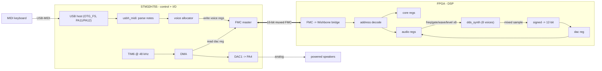
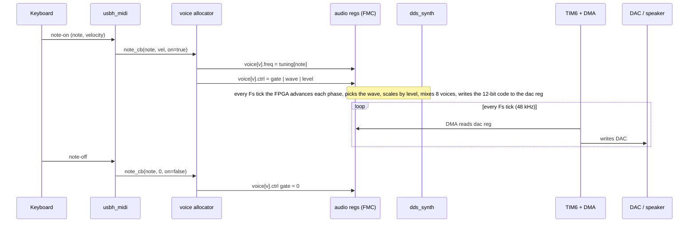
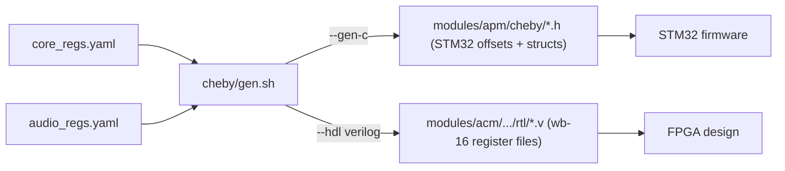
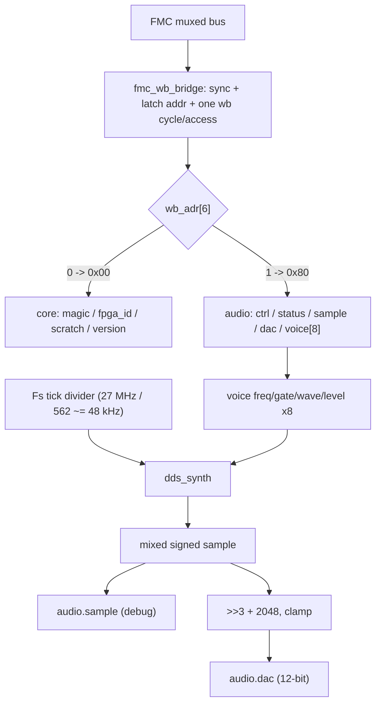
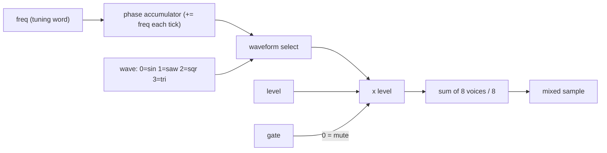
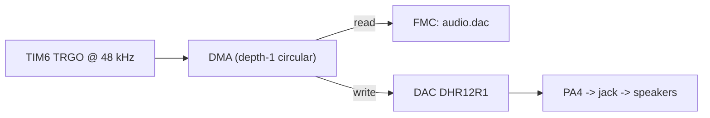
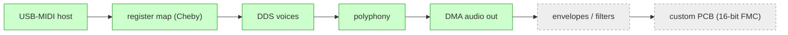

# ACM Synth - Architecture

The Audio Creation Module (ACM) is a hardware polyphonic synthesizer split across
two chips:

- a **STM32H755** (Nucleo-144) as the control + I/O manager - it hosts the USB-MIDI
  keyboard, allocates voices, and streams audio out its DAC.
- an **FPGA** (Tang Nano 20K / GW2AR-18, with a Tang Primer 25K / GW5A-25 as a
  second target) as the DSP - it runs the oscillator bank that actually makes sound.

They talk over a 16-bit multiplexed **FMC** bus, with the register interface defined
once in **Cheby** and generated for both sides.

## Who does what

The guiding split: the **STM32 decides what to play, the FPGA makes the sound.**
After setup, the audio samples never pass through the CPU.

| Concern | STM32H755 | FPGA |
| --- | --- | --- |
| USB-MIDI host + note parsing | yes | - |
| Voice allocation (note -> voice) | yes | - |
| Note -> pitch (tuning word) | yes | - |
| Oscillators / waveforms | - | yes (dds_synth) |
| Mixing | - | yes |
| Sample -> DAC format | - | yes (dac reg) |
| Sample streaming to DAC | DMA only (no CPU) | - |

## End-to-end: a key becomes sound

The two halves run independently: the STM32 only touches the registers on note
events; the FPGA free-runs at the sample rate; the DMA bridges them at Fs.

## FMC register map

One flat FMC address space, decoded on the FPGA by word-address bit 6
(`core` low, `audio` high). All registers are 16-bit (the audio `freq` is 32-bit
across two words).

| FMC byte | block.register | access | meaning |
| --- | --- | --- | --- |
| 0x00 | core.magic | RO | link check, reads 0xACE1 |
| 0x02 | core.fpga_id | RO | board id (0x2018 = 20K, 0x5025 = 25K) |
| 0x04 | core.scratch | RW | scratch / LED debug |
| 0x06 | core.version | RO | gateware version |
| 0x80 | audio.ctrl | RW | engine enable, sample-rate select |
| 0x82 | audio.status | RO | active voice count |
| 0x84 | audio.sample | RO | latest mixed sample, signed (debug) |
| 0x86 | audio.dac | RO | DAC-ready 12-bit code (DMA source) |
| 0xC0 + n*8 | audio.voice[n].freq | RW | 32-bit DDS tuning word |
| 0xC4 + n*8 | audio.voice[n].ctrl | RW | gate (b0), wave (b3:1), level (b15:8) |

> Gotcha: Cheby lays a 32-bit register **big-endian** over the 16-bit bus - the
> low word address holds bits [31:16]. Matters when the STM32 writes `freq`.

## Single source of truth: Cheby

The register layout is written once as YAML and generated for both sides, so the
firmware and the gateware can never disagree on the contract.

- `bus: wb-16` - Wishbone, 16-bit, matched to the FMC so one FMC access = one bus
  cycle, no width adapter.
- RO registers become HDL **input ports** (the design drives them, e.g. per-board
  `fpga_id`); RW registers become stored regs.

## FPGA internals

`acm_top` is a pure-wiring composition root: it connects independent blocks and
holds no policy of its own (identity values come in as ports from the board's
`top.v`).

### A DDS voice

Each of the 8 voices is a numerically-controlled oscillator. The bank is
time-multiplexed (one shared sine LUT + one multiplier walk the voices each tick).

- `freq` (tuning word) sets pitch: `inc = note_freq * 2^32 / Fs`, accumulated each
  sample. The STM32 builds a 128-entry MIDI-note -> tuning-word table.
- `wave` selects sine (LUT) / saw / square / triangle.
- `level` scales amplitude (driven by MIDI velocity); `gate` mutes when off.
- the mix divides by 8 for headroom, so a single voice is quiet by design.

## Audio out: STM32 stays out of the path

The FPGA produces a DAC-ready 12-bit value in `audio.dac`. TIM6 fires at Fs and
triggers a DMA that reads that one FMC register and writes the DAC - no CPU per
sample. The CPU only services USB-MIDI and voice allocation.

## Testing

The RTL is verified in simulation before hardware via **cocotb** benches
(`modules/acm/acm_fpga/sim/cocotb`, run with `make <target>`):

| target | what it proves |
| --- | --- |
| `make fmc` | FMC -> bridge -> core register reads/writes |
| `make dds` | oscillator: silence / saw ramp / gate / level / mixing |
| `make acm` | full datapath: write voices over FMC, read samples + dac code back |
| `make all` | all of the above |

On-target tests live in `modules/apm/tests` (e.g. `test_fmc_core.c`,
`test_fmc_dds_e2e.c`, `test_midi_synth.c`).

## Status

Working end to end today: play the keyboard, hear polyphonic sound, with the
audio streaming itself FPGA -> DAC. Next up are per-voice envelopes / filters and
moving off the breadboard to a PCB (where 16-bit FMC is solid).
